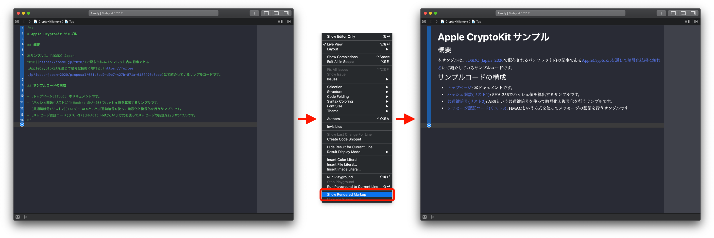
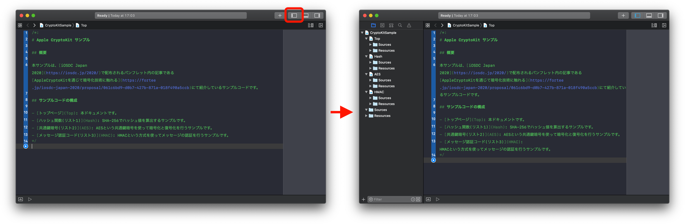

# iOSDC2020-Sample-CryptoKit

 

iOSDC 2020のパンフレット内記事 `AppleCryptoKitを通じて暗号化技術に触れる` のサンプルコードです。

## サンプルコードの内容

**Playground**形式となっています。サンプルコードは次のとおりです。

- [ハッシュ値に関するサンプルコード](https://github.com/kotetuco/iOSDC2020-Sample-CryptoKit/blob/master/CryptoKitSample.playground/Pages/Hash.xcplaygroundpage/Contents.swift)(記事内ではリスト1にあたるコードです)
- [共通鍵暗号による暗号化と復号化に関するサンプルコード](https://github.com/kotetuco/iOSDC2020-Sample-CryptoKit/blob/master/CryptoKitSample.playground/Pages/AES.xcplaygroundpage/Contents.swift)(記事内ではリスト2にあたるコードです)
- [メッセージ認証コードに関するサンプルコード](https://github.com/kotetuco/iOSDC2020-Sample-CryptoKit/blob/master/CryptoKitSample.playground/Pages/HMAC.xcplaygroundpage/Contents.swift)(記事内ではリスト3にあたるコードです)

## Playgroundを使ったコードブラウズTips

### Markdownのレンダリングして閲覧する

サンプルコードはMarkup記法を使ってTopページから各コードに遷移できるようになっています。また、各サンプルコードの解説もMarkup記法で記載されています。ただし、Markup記法で書かれた文書はレンダリングを行わないとプレーンテキストのままの表示になってしまいます。

Markup記法で書かれた文書をレンダリングするには、 `Editor` -> `Show Rendered Markup` を選択することでレンダリングすることができます。

### ファイルツリーを表示する

通常のiOS開発では左ペインのファイルツリーは表示されていることが多いですが、Playgroundは表示されていないことが多く、面食らう方も多いかもしれません。

ファイルツリーを表示するには、Xcode右上の左ペインを表示するためのボタンを押すことで表示することができます。

## 動作環境

- Xcode: 11.6 (筆者の手元では11.6でしか動作確認していませんが、おそらくXcode11.x以降であれば動作すると思います。)
- Apple CryptoKitはiOS13以降でのみ利用可能です。iOSアプリに処理を組み込む際にはDeployment Targetにご注意ください。
